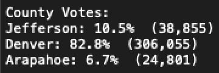
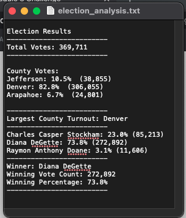

# Module 3 Election_Analysis

## Overview of Project
Using Python to Analyze Election Results

### Purpose
The purpose of this challenge was to use Python to analyse election data provided by Tom and Seth who are looking for faster way to pull information from their raw data .csv file and display readable and relavent information from the data.  They have asked that the Python script return the following:
* Total number of Votes cast
* A Complete list of candidates who received votes
* Total number of votes each candidate received
* Percentag of votes each candidate won
* The winner of the election based on popular vote.
 
 
 ## Results (See Screenshot and Link to Ouput Text File for Reference to Questions Below)
* How many votes were cast in this congressional election?  **There were 369,711 votes cast in the election**

* Provide a breakdown of the number of votes and the percentage of total votes for each county in the precinct.
  * **Jefferson County:**
    * **10.5% of the vote**
    * **38,855 votes in total**
  * **Denver County:**
    * **82.8% of the vote**
    * **306,055 votes in total**
  * **Arapahoe County:**
    * **6.7% of the vote**
    * **24,801 votes in total**

**Note:  The number in parenthesis are the total votes of each county.**
  
  
* Which county had the largest number of votes?  **Denver had the largest number of votes at 306,855.**
  
* Provide a breakdown of the number of votes and the percentage of the total votes each candidate received.
  * **Charles Casper Stockham:**
    * **23.0% of the vote**
    * **82,213 votes in total**
  * **Diana Degette:**
    * **73.8% of the vote**
    * **272,892 votes in total**
  * **Raymon Anthony Doane:**
    * **3.1% of the vote**
    * **11,606 votes in total**
* Which candidate won the election, what was their vote count, and what was their percentage of the total votes?
  **Diana DeGette won the election with 73.8% of the vote which equaled 272,892 votes.

#### Link to Election Analysis Link: [Election_Analysis](analysis/election_analysis.txt)

#### Election_Analysis.txt Screenshot

## Election-Audit Summary: 
This script could be modified to pull and display any number of regional data points such as state and city, allowing analysis at those levels as well.  This could easily be run by adding a City and State column to the .csv file and reading data in the same way as county information.
By modifying the dictionaries within the code, the election commision could view percentage of the county vote and county vote total per candidate. 

